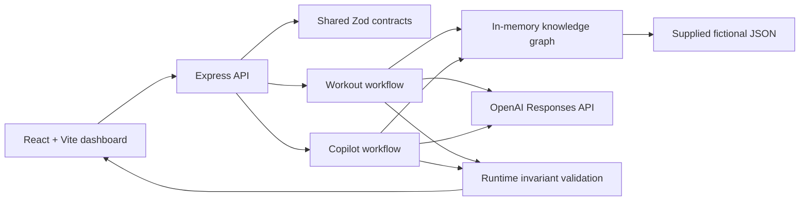
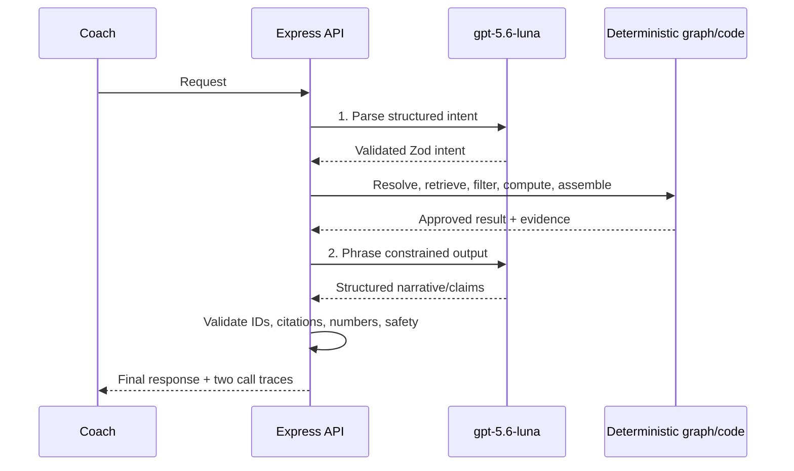

# Coach Copilot

Coach Copilot is a complete local MVP for safe, explainable workout generation and evidence-grounded member intelligence. It is a React/Vite dashboard backed by an Express API, shared Zod contracts, an in-memory knowledge graph, and the OpenAI Responses API. The only member is the supplied fictional Jordan Rivera.

The design rule is simple: the model interprets and phrases; deterministic code owns safety, equipment, exercise selection, calculations, citations, and chart data.

## Run locally

Requirements: Node.js 22+ and an OpenAI API key.

```bash
npm install
cp .env.example .env
# add OPENAI_API_KEY to .env
chmod 600 .env
npm run dev
```

Open <http://127.0.0.1:5173>, click **Continue as Sam**, and choose either product surface. The API listens at <http://127.0.0.1:3001>. `.env` is server-only, ignored by Git, and never returned or logged. `/api/health` exposes only whether a key is configured, the model name, and graph readiness.

`OPENAI_MODEL` defaults to `gpt-5.6-luna`, reasoning defaults to `low`, and every provider request uses `store: false`. Without a key the app remains usable in visibly labeled deterministic-fallback mode. With `REQUIRE_LIVE_MODEL=true`, fallback, refusals, timeouts, schema failures, and incorrect call counts are hard failures.

## Product surfaces

- **Workout Generator:** prompt and duration controls, graph-recomputed adjustments, warmup/main/cooldown phases, equipment and injury constraints, safety notes, exclusions, and expandable provenance.
- **Coach AI Copilot:** quick prompts, free-form questions, eight-turn in-memory context, grounded claims, deterministic charts, attachment placeholders, unavailable-data handling, and expandable citations.

## Architecture



Both successful live workflows make exactly two provider calls:



The SDK integration follows the official [Responses structured-output pattern](https://developers.openai.com/api/docs/guides/structured-outputs). The configured model is documented by OpenAI as supporting Responses and structured outputs: [gpt-5.6-luna model documentation](https://developers.openai.com/api/docs/models/gpt-5.6-luna).

## Knowledge graph

The graph is rebuilt at server startup using adjacency maps. The current supplied data produces 160 nodes and 418 edges.

| Node | Meaning |
| --- | --- |
| `Exercise` | A supplied catalog exercise and its original fields |
| `Anatomy` | Muscles, joints, and the reviewed knee hierarchy |
| `Equipment` | Required or member-available equipment concepts |
| `MovementPattern` | Supplied movement-pattern taxonomy |
| `InjuryOrCondition` | Jordan's active/recovering condition |
| `Member` | Jordan's fictional member identity |
| `MemberFact` | Goals, preferences, workouts, adherence, biomarkers, labs, chat, and brief |

| Edge | Semantics |
| --- | --- |
| `targets` | Exercise engages an anatomy/muscle concept |
| `stresses` | Exercise loads a joint/anatomy concept |
| `requires` | Exercise requires equipment |
| `uses_movement_pattern` | Exercise belongs to a movement pattern |
| `part_of` | Anatomy child-to-parent hierarchy |
| `affects` / `has_condition` | Member condition path to anatomy |
| `has_fact` | Member-to-fact retrieval link |
| `references`, `exact_match`, `alias_of`, `close_match` | Retrieval and concept-mapping semantics |

Every evidence record carries the source label and, where applicable, JSON pointer, date, graph path, ontology URI, and derivation rule.

### Ontology choices

- [OPE](https://bioportal.bioontology.org/ontologies/OPE) provides the modeling boundary: exercise, functional movement, musculoskeletal anatomy, and equipment. The alpha ontology is used as design inspiration; its OWL is not imported wholesale.
- Internal canonical concepts use SKOS-style exact/alias/close mappings. Resolution order is normalized exact match, curated aliases, fuzzy match with a `0.72` threshold and `0.08` ambiguity margin, then unresolved.
- The reviewed anatomy overlay is `patella / patellofemoral area → knee joint → knee region`. The two active SNOMED CT mappings were checked through NCI EVS: [49076000, Knee joint structure](https://api-evsrest.nci.nih.gov/api/v1/concept/snomedct_us/49076000) and [72696002, Knee region structure](https://api-evsrest.nci.nih.gov/api/v1/concept/snomedct_us/72696002).
- PROV-O ideas inform evidence lineage, but the MVP uses plain TypeScript records rather than RDF infrastructure.
- COPPER, SHACL, full SNOMED ingestion, a graph database, and vector search are intentionally outside the MVP. None is needed to demonstrate the required runtime traversal.

## Safety and grounding

For Jordan's mild recovering knee condition, deterministic code:

1. Traverses the condition through the patellofemoral area to the knee parent.
2. Removes plyometrics/high-impact jumps.
3. Removes the reviewed deep-loaded-flexion exercise.
4. Penalizes rather than blanket-removes ordinary knee-loading strength work.
5. Adds a shallow, symptom-free-range instruction and safety citation.
6. Intersects every selected exercise with Jordan's actual equipment.

Unknown anatomy returns `needs_clarification` and no plan. An adjustment references `basePlanId` and recomputes selection from the graph. Model-written workout notes are rejected if they mention unknown exercises/evidence or contradict safety.

Copilot retrieval and calculations are deterministic. Each claim must cite retrieved evidence; cited IDs must exist; numeric tokens must appear in cited raw/derived evidence; chart points never come from the model. Blood pressure is reported unavailable. Vitamin D is reported as `28 ng/mL` on the supplied date without diagnosing deficiency because the source contains no reference range.

This is coaching support over synthetic data, not medical advice. The graph cannot infer conditions, clinical causality, reference ranges, or clearance beyond what the supplied record states.

## Scripts

| Command | Purpose |
| --- | --- |
| `npm run dev` | Run API and dashboard together |
| `npm run typecheck` | Check client/shared/server TypeScript |
| `npm run lint` | Lint implementation and test code |
| `npm test` | Deterministic units and API integration with controlled model responses |
| `npm run test:evals` | Full 20-workout + 24-Copilot controlled semantic matrix and follow-ups |
| `npm run test:live` | Full unretried matrix using the real key; writes ignored evidence to `artifacts/live-evaluation.json` |
| `npm run test:quality:live` | 30 natural workout/Copilot interactions with follow-ups, citation relevance, answer-scope, and safety checks |
| `npm run test:e2e` | Offline Playwright browser flows |
| `npm run test:e2e:live` | Live Playwright flows; real responses required |
| `npm run build` | Production client and server build |
| `npm run verify` | Run every static, controlled, build, offline-browser, live-eval, and live-browser gate |

## Verified generated examples

The following text is copied from the successful, unretried `gpt-5.6-luna` evaluation run on 2026-08-12, not handwritten sample copy.

**Injury-aware workout — W01**

> 30-minute lower body session
>
> Maintain shallow, comfortable ranges for knee-loading movements and stop if knee symptoms or pain increase. Knee-loading jumps and deep loaded knee flexion are excluded.

The response was `mode=live`, `modelCallCount=2`, and totaled exactly 30 minutes.

**Limited equipment — W05**

> 30-minute full body session
>
> Walking Toe Touches · Alternating Dumbbell Overhead Press · Dumbbell Goblet Split Squat · Alternating Dumbbell Racked Crossback Lunge · Standing Neck Circles

No selected movement required equipment outside Jordan's dumbbells/kettlebell constraint; the response was `mode=live`, `modelCallCount=2`.

**Copilot adherence — C04**

> Weekly workout completion was 100%, 100%, 75%, and 50% over the supplied four weeks.
>
> That is a 50 percentage-point decrease from the first supplied week to the latest.

The deterministic chart contains `05-12: 100`, `05-19: 100`, `05-26: 75`, and `06-02: 50`.

**Copilot sleep — C06**

> The seven supplied readings average 6.3 hours (43.9 hours divided by 7).
>
> Two of the seven readings were at or above 7 hours.

## Evaluation result

The original live matrix passed **43/44 (97.7%)** in one unretried run with no critical failures. After a second natural-language quality/fix cycle, the final 30-interaction live audit passed **30/30 (100%)** with relevant citations and exactly scoped answers. All 14 live browser tests passed; offline browser tests cover desktop, tablet, and phone. Full scenario results, browser coverage, latency/token summaries, and limitations are in [docs/EVALUATION.md](docs/EVALUATION.md).

Production evaluation should retain these invariant checks, add held-out paraphrases and adversarial prompts, stratify semantic graders by topic, monitor latency/token distributions, and require human review of safety-rule changes. A green schema parse alone is not a quality result; the final visible answer and citations are what the suite evaluates.

## AI-use disclosure

OpenAI models are used only at runtime for structured intent parsing and constrained phrasing. Codex assisted with the implementation, documentation, and test construction. Safety rules, derived metrics, source data, expected facts, and validation criteria remain explicit in repository code/tests and are independently inspectable.

## Source material and scope

- [Assessment](docs/assignment/ASSESSMENT.md)
- [Pinned upstream source](docs/assignment/SOURCE.md)
- [Exercise catalog](data/exercises.json)
- [Synthetic member context](data/member-context.json)
- [Implementation plan](plan.md)

No database, vector store, deployment, external resource, real member record, or multi-agent runtime is included.
