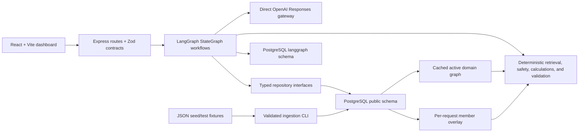
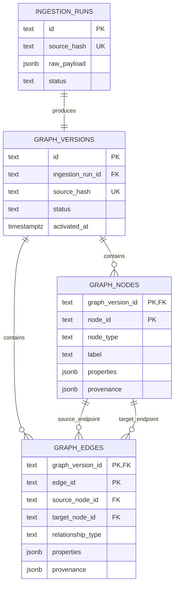
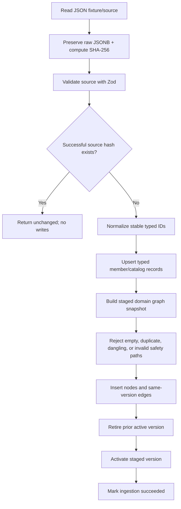
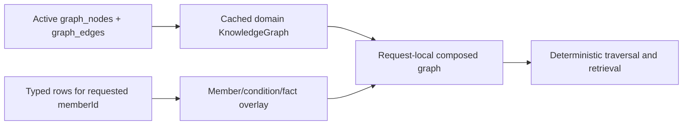
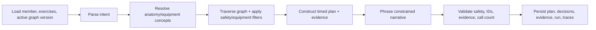
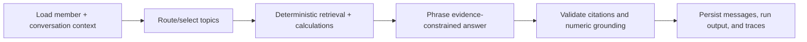

# Coach Copilot production architecture

This document is the source of truth for the PostgreSQL + LangGraph backend. The supplied JSON files are ingestion fixtures, not runtime databases. PostgreSQL owns canonical application records and immutable domain-graph versions; LangGraph owns workflow execution and checkpoints.

## System boundary

The runtime has five layers:

1. Express validates HTTP input and preserves the existing response contracts.
2. Separate Workout and Copilot `StateGraph` workflows define execution boundaries and checkpoint state.
3. Existing deterministic TypeScript services own safety traversal, equipment filters, calculations, evidence construction, and final validation.
4. Repositories isolate workflows from PostgreSQL and provide in-memory implementations for unit/API tests.
5. The direct OpenAI Responses gateway remains the only model integration. LangChain agents and model-controlled tools are not used.

Production startup is intentionally strict. It requires `DATABASE_URL`, the Drizzle migration table, typed seed records, one active non-empty graph version, and initialized LangGraph checkpoint tables. Missing state prevents the server from listening; JSON is never used as a fallback.

## PostgreSQL ownership

The `public` schema is the canonical domain store.

| Area | Tables | Ownership |
| --- | --- | --- |
| Tenant/member | `organizations`, `coaches`, `members` | Stable ownership and future tenant isolation keys |
| Member context | `member_goals`, `member_preferences`, `member_equipment`, `member_conditions` | Typed member facts used to create the member overlay |
| Activity | `workout_sessions`, `workout_session_exercises`, `adherence_observations` | Historical activity and deterministic adherence data |
| Biomarkers/labs | `biometric_observations`, `lab_reports`, `lab_observations` | Timestamped numeric observations and units |
| Conversation | `conversations`, `messages`, `message_attachments` | Canonical multi-turn product history |
| Coach intelligence | `coach_briefs`, `risk_assessments` | Supplied brief and risk inputs |
| Catalog | `exercises` | Typed exercise records used by workout construction |
| Generated artifacts | `workflow_runs`, `generated_workout_plans`, `model_call_traces` | Durable outputs, decisions, evidence, and provider traces |
| Ingestion/graph | `ingestion_runs`, `graph_versions`, `graph_nodes`, `graph_edges` | Raw lineage and immutable domain graph snapshots |

The separate `langgraph` schema contains checkpoint package tables. It is execution infrastructure only. It is not the member database, message history, generated-plan store, or knowledge graph.

Authentication and identity-provider-backed row-level security are out of scope. Every domain row already carries organization/member ownership where appropriate so those controls can be added without redesigning the storage model.

## Immutable graph storage

`graph_nodes` stores concepts/entity nodes and `graph_edges` stores relationships/edges. Both are keyed by `graph_version_id`.

Composite foreign keys require both endpoints to exist in the same graph version. A unique relationship constraint rejects duplicate source/type/target edges. A partial unique index allows only one version with `status = 'active'`.

Domain versions contain stable concepts: exercises, anatomy, equipment, and movement patterns. Member identity, conditions, and member facts stay in typed tables and become an ephemeral member overlay. This avoids duplicating sensitive member data into every immutable domain snapshot.

## Ingestion and activation

Typed writes, graph staging, validation, and activation occur in one database transaction. A database failure leaves the prior active version untouched. The SHA-256 hash covers the schema version plus both source payloads, making repeated seed execution a no-op.

Raw JSON is stored in `ingestion_runs.raw_payload` for reproducibility because the current fixture is small. If payloads become large binary documents, raw blobs should move behind an object-storage interface while PostgreSQL retains the content hash, URI, media type, and lineage. That boundary is deferred.

Commands:

- `npm run db:migrate` applies application migrations.
- `npm run db:seed` runs validated, idempotent ingestion.
- `npm run db:langgraph:setup` initializes checkpoint tables explicitly.
- `npm run db:setup` runs all three in order.
- `npm run db:test:setup` may destroy only a database whose name ends in `_test`.

Runtime startup never runs schema DDL or ingestion.

## Runtime graph composition and refresh

The active domain graph is reconstructed once during startup and cached. Every request checks the cache's 30-second refresh deadline. At expiry, one refresh loads the currently active version, validates that it is non-empty, and atomically swaps the cache reference. In-flight requests retain the prior graph object and are not disrupted.

The requested `memberId` is loaded from typed rows and composed with the cached domain graph. `/api/member` remains a demo alias for `DEMO_MEMBER_ID`; workflow routes are genuinely member-ID-driven and return `404` for unknown members.

## LangGraph workflows

LangGraph controls sequencing and durable execution state. It does not decide which tools to call, select unsafe exercises, activate graph versions, calculate metrics, or persist canonical records.

### Workout

The compiled implementation groups the existing parse/resolve/traverse/construct/phrase service into one StateGraph node so its proven two-call contract and deterministic fallback remain unchanged. Load, final validation, and persistence are separate graph nodes. A workflow-run UUID is the LangGraph `thread_id`; the checkpoint namespace is `workout`.

### Copilot

Routing, retrieval, calculation, and phrasing remain inside the existing two-call service and are bracketed by separate load, validation, and persistence nodes. The canonical conversation ID is the LangGraph `thread_id`; the checkpoint namespace is `copilot`. Because canonical turns also live in `conversations/messages`, follow-ups survive both application and checkpoint recreation.

Unit/API tests compile the same workflows with `MemorySaver` and in-memory repositories. Production uses `PostgresSaver` in the `langgraph` schema. No LangGraph, LangChain, LangSmith, or hosted-platform account is required. LangSmith tracing remains disabled.

## Deterministic invariants

- A live successful workflow makes exactly two Responses API calls: intent and constrained phrasing.
- Fallback remains deterministic when live inference is optional.
- Models never control graph activation, relationship traversal, equipment filtering, safety rules, calculations, chart points, or database writes.
- Unknown anatomy yields clarification instead of a plan.
- Knee traversal must follow the condition → patellofemoral area → knee hierarchy and exercise `stresses` edges.
- Selected exercises must use available/requested equipment and all prescription evidence IDs must exist.
- Every Copilot narrative claim must cite included evidence; calculations and charts originate in code.
- Canonical plans, messages, evidence, decisions, and model-call traces are committed in application tables independently of checkpoint storage.

## Readiness, recovery, and privacy

`GET /api/health` preserves the lightweight public contract. `GET /api/ready` checks PostgreSQL connectivity, the Drizzle migration table, seed/catalog availability, the active graph version, and readable checkpoint tables; it returns `503` when any dependency is unavailable.

Recovery rules:

- Failed migration: fix/roll forward the migration; startup stays blocked.
- Invalid ingestion: reject the transaction and retain the previous active graph.
- Database outage: readiness fails and workflows fail without JSON fallback.
- Model failure: use deterministic fallback unless `REQUIRE_LIVE_MODEL=true`.
- Process restart: reload the active graph; canonical conversations/plans and LangGraph checkpoints remain in PostgreSQL.
- Graph refresh failure after startup: requests can continue on the last validated cached version; readiness exposes refresh/database failure on its next check.

The demo data is fictional. Provider requests use `store: false`; API keys are server-only. Real member/PHI ingestion requires authentication, authorization, audit policy, encryption/key management, retention/deletion policy, tenant RLS, and a formal vendor/privacy review before production use.

## When to consider Neo4j

PostgreSQL is the correct canonical store while traversals are bounded, the graph fits comfortably in application memory, writes are versioned batches, and joins to typed member/workflow data matter. Consider a separate graph database only after measured requirements show at least one of:

- graph snapshots no longer fit within acceptable service memory;
- request-time traversals need deep, variable-length, multi-hop queries PostgreSQL plus the cache cannot meet;
- graph writes become high-volume incremental operations rather than versioned ingestion;
- independent graph analytics or graph-native access controls become a primary workload.

Even then, PostgreSQL should remain the system of record for members, conversations, plans, lineage, and workflow artifacts. A graph database would be a derived query projection, not a replacement for LangGraph (workflow orchestration) or canonical application persistence.
